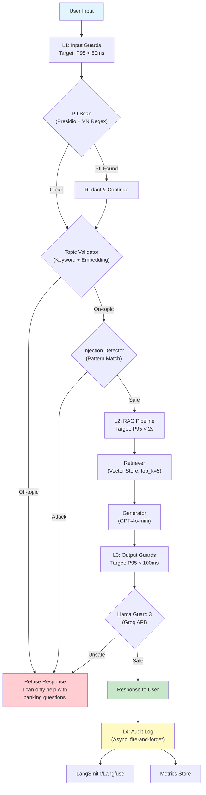

# Production Blueprint: RAG Evaluation & Guardrail System
**VietBank AI Assistant — Production Deployment Guide**

---

## Section 1: SLO Definitions

| Metric | Target | Alert Threshold | Window | Severity |
|---|---|---|---|---|
| Faithfulness | ≥ 0.85 | < 0.80 for 30 min | Rolling 1h | P2 |
| Answer Relevancy | ≥ 0.80 | < 0.75 for 30 min | Rolling 1h | P2 |
| Context Precision | ≥ 0.70 | < 0.65 for 1h | Rolling 2h | P3 |
| Context Recall | ≥ 0.75 | < 0.70 for 1h | Rolling 2h | P3 |
| P95 Latency (with guardrails) | < 2.5s | > 3s for 5 min | Rolling 15m | P1 |
| Guardrail Detection Rate | ≥ 90% | < 85% for 1h | Rolling 4h | P2 |
| False Positive Rate | < 5% | > 10% for 1h | Rolling 4h | P2 |

**Error Budget Policy:**
- P1 incidents consume 100% of monthly error budget
- P2 incidents trigger investigation within 4 hours
- P3 incidents reviewed in weekly quality meeting
- When monthly error budget < 20% remaining, freeze non-critical deploys

---

## Section 2: Architecture Diagram

### Component Details

| Layer | Component | Technology | Latency Budget |
|-------|-----------|-----------|---------------|
| L1 | PII Redaction | Presidio + VN regex | < 10ms |
| L1 | Topic Validator | Keyword matching + cosine similarity | < 20ms |
| L1 | Injection Detection | Pattern matching + keyword filter | < 5ms |
| L2 | Retriever | FAISS/Chroma vector store | < 200ms |
| L2 | Generator | GPT-4o-mini via OpenAI API | < 1500ms |
| L3 | Safety Check | Llama Guard 3 via Groq API | < 80ms |
| L4 | Audit Logging | Async write to LangSmith | Non-blocking |

**Total latency budget: < 2500ms (P95)**

---

## Section 3: Alert Playbook

### Incident 1: Faithfulness Drops Below 0.80

**Severity:** P2
**Detection:** Continuous RAGAS eval on 1% sample, alert via Prometheus + PagerDuty

**Likely causes:**
1. Retriever returning irrelevant chunks (check Context Precision simultaneously)
2. LLM prompt template changed without eval gate approval
3. Document corpus updated without re-indexing vector store
4. Model version drift (OpenAI model update)

**Investigation steps:**
1. Check Context Precision score in same timeframe — if also degraded, root cause is retrieval
2. Run `git log` on prompt templates — diff against last known-good version
3. Check document ingestion pipeline logs for recent corpus updates
4. Verify OpenAI model version matches expected (check API response headers)

**Resolution:**
- Retrieval issue → re-index vector store, tune `top_k` and similarity threshold
- Prompt drift → rollback to last known-good prompt version via feature flag
- Corpus issue → trigger re-ingestion pipeline, wait for index rebuild
- Model drift → pin model version in API calls (e.g., `gpt-4o-mini-2024-07-18`)

**SLO impact:** Track TTD (time to detect) target < 30min, TTR (time to recover) target < 2h

---

### Incident 2: P95 Latency Exceeds 3 Seconds

**Severity:** P1
**Detection:** Real-time latency monitoring via Datadog/Grafana, alert within 5 minutes

**Likely causes:**
1. LLM API provider experiencing high latency or rate limiting
2. Vector store query performance degraded (index corruption, resource exhaustion)
3. Guardrail layer bottleneck (Llama Guard API timeout)
4. Increased traffic beyond provisioned capacity

**Investigation steps:**
1. Check per-layer latency breakdown (L1, L2, L3) to identify bottleneck
2. Monitor OpenAI/Groq API status pages
3. Check server resource utilization (CPU, memory, network)
4. Review recent deployment changes that might affect performance

**Resolution:**
- API latency → switch to backup provider, enable response caching for common queries
- Vector store → restart service, rebuild index if corrupted
- Guardrail timeout → increase timeout threshold, fall back to keyword-based safety check
- Traffic spike → auto-scale compute, enable request queuing with backpressure

**SLO impact:** P1 requires immediate response. Escalate to on-call within 5 minutes. TTR target < 30min.

---

### Incident 3: Guardrail Detection Rate Drops Below 85%

**Severity:** P2
**Detection:** Weekly adversarial test suite + continuous monitoring of blocked/total ratio

**Likely causes:**
1. New attack patterns not covered by current guardrail rules
2. Topic validator threshold too permissive after recent tuning
3. Llama Guard model serving errors (silent failures returning "safe")
4. PII regex patterns incomplete for new data formats

**Investigation steps:**
1. Review recent adversarial test results — identify new bypass patterns
2. Analyze false negatives — categorize by attack type (DAN, roleplay, injection)
3. Check Llama Guard API response codes — look for 5xx errors being treated as "safe"
4. Review PII test coverage — check for new PII formats in user inputs

**Resolution:**
- New attack patterns → update keyword blocklist and injection detection rules
- Threshold drift → re-calibrate topic validator with updated test set
- Model serving → add health checks, implement retry with exponential backoff
- PII gaps → extend VN_PII regex patterns, add new entity recognizers to Presidio

**SLO impact:** Schedule fix within 4 hours. Run full adversarial test suite after fix to verify.

---

## Section 4: Cost Analysis

### Monthly Cost Estimate (100,000 queries/month)

| Component | Unit Cost | Volume | Monthly Cost |
|---|---|---|---|
| RAG generation (GPT-4o-mini) | $0.00015/1K input + $0.0006/1K output | 100K queries | ~$90 |
| RAGAS continuous eval (1% sample) | ~$0.01/evaluation | 1,000 evals | $10 |
| LLM Judge — routine (gpt-4o-mini) | $0.001/judgment | 10,000 | $10 |
| LLM Judge — deep review (gpt-4o) | $0.03/judgment | 500 | $15 |
| Presidio (self-hosted) | CPU only | 100K | $0 |
| Llama Guard 3 (Groq API) | Free tier / $0.05/1M tokens | 100K | ~$5 |
| LangSmith logging | Free tier (5K traces) / $39/mo | 100K | $39 |
| Infrastructure (compute) | ~$0.10/hr (2 vCPU) | 720hr | $72 |
| **Total** | | | **~$241/month** |

### Cost Optimization Opportunities

1. **Response caching** — Cache frequent queries (est. 30% hit rate) → save ~$27/mo on LLM calls
2. **Tiered evaluation** — Use gpt-4o-mini for routine checks, gpt-4o only for flagged responses → save ~$10/mo
3. **Llama Guard self-hosted** — If GPU available, eliminate API costs → save $5/mo but add ~$150/mo GPU cost (only worthwhile at >500K queries/mo)
4. **Eval sampling** — Increase from 1% to 2% only during rollouts, keep 0.5% steady-state → save ~$5/mo
5. **Batch processing** — Use OpenAI Batch API for non-real-time evaluations (50% cost reduction) → save ~$5/mo

### Cost at Scale

| Scale | Queries/month | Est. Monthly Cost | Cost per Query |
|-------|--------------|-------------------|---------------|
| Startup | 10K | ~$50 | $0.005 |
| Growth | 100K | ~$241 | $0.0024 |
| Scale | 1M | ~$1,800 | $0.0018 |
| Enterprise | 10M | ~$12,000 | $0.0012 |

Unit economics improve significantly at scale due to fixed infrastructure costs and caching benefits.
